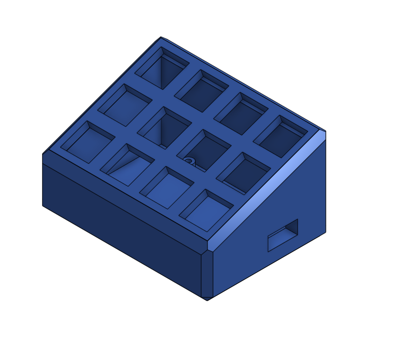

12Keys
=========================

Simple 4x3 keypad based on  sparkfun Pro Micro16 (ATMEGA32u)

Simple Keypad wit 12 Cherry keys
based on Sparkfun Promicro16 , Arduino framework, HID-Project and Keypad Arduino Libraries

The Keypad library (https://github.com/Kilill/Keypad) is a fork of the original (Nullkraft/Keypad) that was modified to use 
inverse polarity so that the builtin pullup mode can be used on the input pins

For now the keycodes sent are hardcoded to F13-F24.

stl files for the box in Box_stl, original cad files available at Onshape (https://cad.onshape.com/documents/40ae31b557922159d2ed2d0b/w/9c1bdd77bb5f1145a6e99902/e/60aaf16164ad439e5726a2aa)
